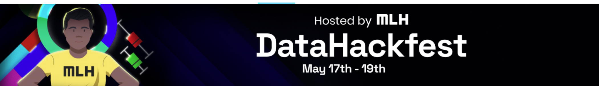

 ### Best Data Visualisation Hack at Dataday Grind III by MLH

 

Check out the project video here - [YouTube](https://www.youtube.com/watch?v=gzWx8E4rV8E)

## Inspiration💡
 - Applying to Jobs today has still been following the traditional methods of applying on resume-shortlisting websites and receiving a cold reply or at most times no replies from the said organisations. The key problem that candidates face in such scenarios is the lack of tangible understanding the lackonas, pitfalls that cause them to be rejected at multiple job listing websites as there is generally less or no reviews upon their candidature. 
 - Secondly, Students are often confused about the type of job roles they are a fit for right after their graduation, or maybe even before. If they could be connected with the right kind of objective data understanding as to the careers pursued by other people at their age with similar profiles, they would be at a much better state of understanding what sort of career options are available to them. 

## What it does 🧭

Our Project aims to achieve a objective solution to these 2 growing problems: 

 - Giving candidates tangible profile scores based on their previous qualifications, achievements and extracurriculars. 
 - Connecting candidates to the right domains of jobs based on their profile to kickstart their careers. 

## How we built it 🔧

Our solution was built with techniques as data cleaning, feature engineering and modelling algorithms that can accurately rank candidates by comparing profiles of numerous other candidates. 
Dataset obtained through Kaggle, Coded with <3 using Python. 

## Tech Stack 🔨
1. Data Science
2. Python
3. Jupyter Notebook
4. Anaconda
5. Git
6. GitHub

## Challenges we ran into 🏃♂️

1. Implementing a scalable solution was difficult given the limited resources of our own local systems. 
2. The Dataset comprises of jobs from all possible domains ranging from truck drivers to accountants to developers, so the recommendations are based on an weighted average across categories. 

## Accomplishments that we're proud of 🏅
1. We made the analysis to understand how the job market has evolved through the stages in different domains
2. Implemented models for both problems with accurate enough results (based on testing with our very own profiles!)

## What we learned 🧠
1. ML techniques the non-traditional way - without the use of pre-defined models or complex techniques, we were able to derive substantial mathamatical equations using functions as cosine similarity, weighted averages, TF-IDF Vectorizer and K-means Clustering.
2. For the same job, candidates could have widely ranging profiles; e.g. people could be working as SDE-2 at the age of 24 as well as 37, this wide variety led us to implement sampling within the dataset to avoid extreme differences between runs of the same candidate. 

## What's next ⏭
 1. For future additions we aim to take in a document which could be a candidate's own Resume and process the same without needing for additional inputs from the candidates, this in turn would be a better suited environment for candidates to test out their tangible strengths before presenting the same to a recruiter. 

## Collaborators 🤖

No Beep-Bops, Only Data Scientists.

| Name      | GitHub Profile     |
| :------------- | :----------: |
|  Gyanesh Samanta   | [GitHub](https://www.github.com/gyanesh-samanta-123) |
|  Rhythm Srivastav  | [GitHub](https://github.com/RhythmSrivastava) |