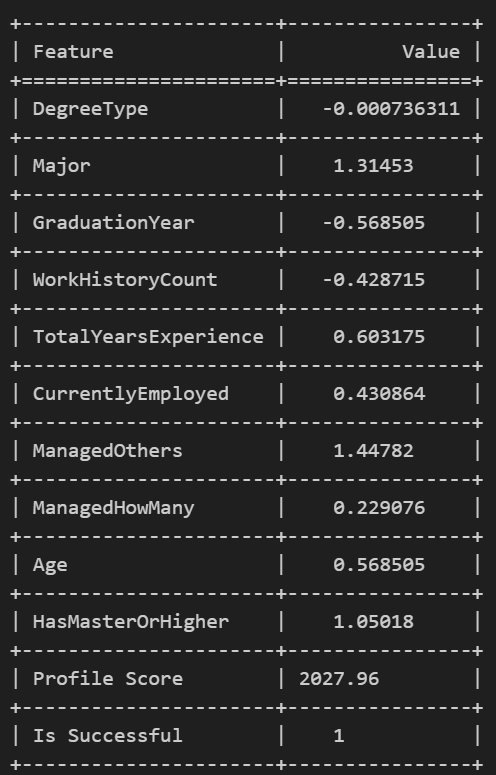

# Data Hackfest — Profile Scorer & Job Recommender

> **Winner: Best Data Visualisation Hack at Dataday Grind III by MLH.**


[Watch the demo on YouTube](https://www.youtube.com/watch?v=gzWx8E4rV8E)

## About

- **What:** A two-part data science project that (1) scores a candidate's profile against a corpus of real job-seekers and (2) recommends job domains they're statistically a fit for.
- **Who:** Gyanesh Samanta and Rhythm Srivastav, hacking together as "No Beep-Bops, Only Data Scientists."
- **When:** Built over the Dataday Grind III hackathon weekend, May 19, 2024.
- **Where:** Submitted to **Dataday Grind III**, an MLH-affiliated data hackathon.
- **Why:** Job-application platforms send cold rejections without telling candidates *why* — and students rarely have an objective view of which roles match their profile. We wanted to fix both with math, not vibes.

## The Story

Most job portals are black boxes. You upload a resume, you get a templated rejection (or silence), and you're left guessing which line on your CV cost you the interview. We started Dataday Grind III with that frustration and a Kaggle dataset of real candidate profiles, then asked: *what if we could score a profile the same way the model behind the curtain does, and tell the candidate what their realistic next moves are?*

The first notebook (`ProfileScorer.ipynb`) builds a tangible score from qualifications, achievements, and extracurriculars using cosine similarity and TF-IDF on the candidate corpus. The second (`Job_recommendation.ipynb`) clusters candidates with K-means and surfaces the job domains other people-with-your-profile actually ended up in. No black-box deep nets — just interpretable similarity math you can trace from input to output.

The hardest part wasn't the modeling, it was the data. The dataset spans truck drivers, accountants, and SDEs all in one table, so a single global average is meaningless. We sampled inside categories to keep recommendations stable run-to-run, and weighted similarity across domains to handle wildly different career paths converging on the same role.

## Gallery



---

## Tech Stack

- **Language:** Python 3
- **Notebooks:** Jupyter (via Anaconda)
- **Techniques:** Cosine similarity, TF-IDF Vectorizer, K-means clustering, weighted averages
- **Data source:** Kaggle (link in `Repository-Assests/Kaggle Dataset Link.txt`)

## Repo Structure

```
Data-Hackfest/
├── Notebook/
│   ├── EDA.ipynb                 # Exploratory data analysis
│   ├── datapreprocessing.ipynb   # Cleaning + feature engineering
│   ├── ProfileScorer.ipynb       # Candidate scoring model
│   └── Job_recommendation.ipynb  # Domain recommender
└── Repository-Assests/
    ├── HackathonPoster.png
    ├── 2.png
    └── Kaggle Dataset Link.txt
```

## Getting Started

```bash
git clone https://github.com/GyaneshSamanta/Data-Hackfest.git
cd Data-Hackfest

# Recommended: an Anaconda environment
conda create -n hackfest python=3.10 pandas numpy scikit-learn jupyter
conda activate hackfest

# Download the dataset from the Kaggle link in Repository-Assests/
jupyter notebook Notebook/
```

Run the notebooks in order: `datapreprocessing.ipynb` → `EDA.ipynb` → `ProfileScorer.ipynb` → `Job_recommendation.ipynb`.

## Contributing

Hackathon code is hackathon code — but if you'd like to extend the resume-parsing roadmap (see "What's next" below), open a PR or issue.

**What's next:** accept a raw PDF resume and run the pipeline end-to-end without manual feature input.

## License

Released under the [MIT License](LICENSE).

## Credits

| Name | GitHub |
| :--- | :----- |
| Gyanesh Samanta | [@GyaneshSamanta](https://github.com/GyaneshSamanta) |
| Rhythm Srivastav | [@RhythmSrivastava](https://github.com/RhythmSrivastava) |

Dataset courtesy of Kaggle. Hackathon hosted by Major League Hacking (MLH) — Dataday Grind III.
